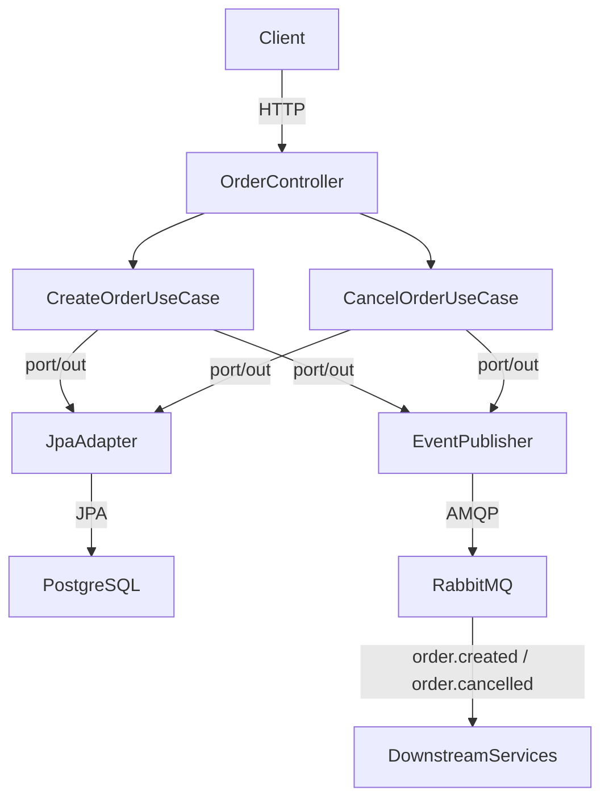

# order-service

<p align="center">
  
  
  
  
  
  
</p>

Entry point of the [Order Processing System](https://github.com/mh001-code) — a microservices portfolio project demonstrating asynchronous messaging, distributed systems, and clean hexagonal architecture.

---

## Table of Contents

- [About](#about)
- [Architecture](#architecture)
- [Tech Stack](#tech-stack)
- [Business Rules](#business-rules)
- [Running Locally](#running-locally)
- [Endpoints](#endpoints)
- [Technical Decisions](#technical-decisions)

---

## About

The `order-service` is the entry point of the system. It receives customer orders via REST, applies business rules, persists them in PostgreSQL, and publishes domain events to RabbitMQ so downstream services can react independently — without any direct coupling.

```
Client → POST /orders → order-service → PostgreSQL
                                      → RabbitMQ (order.created / order.cancelled)
                                                  ↓                  ↓
                                        inventory-service   notification-service
```

---

## Architecture

The project follows **Hexagonal Architecture (Ports & Adapters)**, keeping the domain isolated from infrastructure concerns.

```
┌─────────────────────────────────────────────────────┐
│                     API Layer                        │
│           Controllers · DTOs · ExceptionHandler      │
└──────────────────────┬──────────────────────────────┘
                       │
┌──────────────────────▼──────────────────────────────┐
│                 Application Layer                    │
│            Use Cases · Port Interfaces               │
└──────────────────────┬──────────────────────────────┘
                       │
┌──────────────────────▼──────────────────────────────┐
│                  Domain Layer                        │
│       Order · OrderItem · OrderStatus · Exceptions   │
└─────────────────────────────────────────────────────┘
                       │
┌──────────────────────▼──────────────────────────────┐
│              Infrastructure Layer                    │
│       JPA Adapter · RabbitMQ Publisher · Config      │
└─────────────────────────────────────────────────────┘
```



**Base package:** `com.orderprocessing.order.service`

```
com.orderprocessing.order.service
├── domain
│   ├── model          # Order, OrderItem, OrderStatus
│   └── exception      # OrderNotFoundException, OrderAlreadyCancelledException, InvalidOrderException
├── application
│   ├── usecase        # CreateOrderService, CancelOrderService
│   └── port
│       ├── in         # CreateOrderUseCase, CancelOrderUseCase
│       └── out        # OrderRepositoryPort, OrderEventPublisherPort
├── infrastructure
│   ├── persistence    # JPA repositories + adapters
│   ├── messaging      # RabbitMQ publisher, event records
│   └── config         # RabbitMQConfig
└── api
    ├── controller     # OrderController, HealthController
    ├── dto            # Request/Response records
    └── handler        # GlobalExceptionHandler
```

---

## Tech Stack

| Technology | Version | Role |
|---|---|---|
| [Java](https://openjdk.org/) | 17 | Primary language |
| [Spring Boot](https://spring.io/projects/spring-boot) | 3.5 | Web framework + DI |
| [Spring AMQP](https://spring.io/projects/spring-amqp) | — | RabbitMQ integration |
| [Spring Data JPA](https://spring.io/projects/spring-data-jpa) | — | ORM persistence |
| [PostgreSQL](https://www.postgresql.org/) | 16 | Relational database |
| [Flyway](https://flywaydb.org/) | — | Database migrations |
| [Lombok](https://projectlombok.org/) | — | Boilerplate reduction |
| [JUnit 5 + Mockito](https://junit.org/junit5/) | — | Unit testing |
| [Testcontainers](https://testcontainers.com/) | — | Integration tests with real PostgreSQL + RabbitMQ |
| [Docker](https://www.docker.com/) | — | Containerization (multi-stage build) |
| [Railway](https://railway.app/) | — | Production hosting |
| [GitHub Actions](https://github.com/features/actions) | — | CI/CD pipeline |

---

## Business Rules

- `totalAmount` must be **≥ R$1.00** — otherwise `422 Unprocessable Entity`
- Item `quantity` must be between **1 and 100**
- Order status flow: `PENDING` → `CONFIRMED` → `CANCELLED`
- Cancelling an already-cancelled order returns `409 Conflict`
- After confirmation, `order.created` is published to RabbitMQ
- After cancellation, `order.cancelled` is published to RabbitMQ

### Events published

| Event | Routing Key | Payload |
|---|---|---|
| `OrderCreatedEvent` | `order.created` | `orderId`, `customerId`, `items`, `totalAmount` |
| `OrderCancelledEvent` | `order.cancelled` | `orderId`, `customerId`, `reason` |

Dead Letter Queues (`order.created.dlq`, `order.cancelled.dlq`) capture messages that fail processing in downstream services.

---

## Running Locally

### Prerequisites

- Java 17+
- Docker and Docker Compose
- Maven (or use the included `./mvnw` wrapper)

### 1. Clone the repository

```bash
git clone https://github.com/mh001-code/order-service.git
cd order-service
```

### 2. Start PostgreSQL and RabbitMQ

```bash
docker-compose up -d
```

PostgreSQL on port `5435` · RabbitMQ on port `5672` · Management UI on `15672`

### 3. Run the application

```bash
./mvnw spring-boot:run
```

The API will be available at `http://localhost:8085`.
RabbitMQ Management UI: http://localhost:15672 (guest / guest)

### 4. Run the tests

```bash
# All tests including integration (Docker required for Testcontainers)
./mvnw test
```

---

## Endpoints

| Method | Route | Description | Status |
|---|---|---|---|
| `POST` | `/orders` | Create a new order | 201 |
| `GET` | `/orders/{id}` | Get order by ID | 200 / 404 |
| `GET` | `/orders?customerId={id}` | List orders for a customer | 200 |
| `PATCH` | `/orders/{id}/cancel` | Cancel an order | 200 / 404 / 409 |
| `GET` | `/health` | Health check | 200 |

### Create Order — Example

```json
POST /orders
{
  "customerId": "550e8400-e29b-41d4-a716-446655440000",
  "items": [
    {
      "productId": "a3bb189e-8bf9-3888-9912-ace4e6543002",
      "productName": "Notebook",
      "quantity": 1,
      "unitPrice": 3500.00
    }
  ]
}
```

### HTTP Status Codes

| Status | Situation |
|---|---|
| `201 Created` | Order successfully created |
| `200 OK` | Query or cancellation successful |
| `404 Not Found` | Order not found |
| `409 Conflict` | Order already cancelled |
| `422 Unprocessable Entity` | Total below R$1.00 or invalid quantity |

---

## Technical Decisions

**RabbitMQ over direct REST calls**
The `order-service` has zero knowledge of `inventory-service` or `notification-service`. It only publishes events. This means downstream services can be added, removed, or restarted without any change here — and if a consumer is temporarily down, messages queue up safely instead of failing.

**Dead Letter Queues**
Messages that fail processing after exhausting retries are routed to DLQs (`order.created.dlq`, `order.cancelled.dlq`). This prevents data loss and gives operators visibility into processing failures without blocking the main queues.

**Hexagonal Architecture**
Use cases depend on port interfaces, not concrete implementations. `CreateOrderService` calls `OrderRepositoryPort` and `OrderEventPublisherPort` — it has no idea whether the backing store is PostgreSQL or the broker is RabbitMQ. This makes unit testing straightforward with pure Mockito mocks.

**Testcontainers for integration tests**
Tests that mock the database can pass even when real SQL behavior would fail. Testcontainers spins up a real PostgreSQL and RabbitMQ instance per test run, ensuring migrations, constraints, and event publishing behave exactly as in production.

---

<p align="center">
  Built by <a href="mailto:marcioincode@gmail.com">Márcio Henrique</a>
</p>
